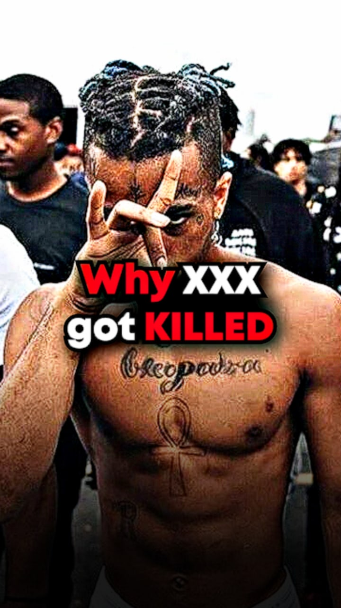

# The Superformat

The Superformat is a template you use in your TikTok videos to increase the likelyhood of someone watching your video.

It works by putting a lifestyle footage of Tate at the beginning of your video for half a second in combination with a good, and easy to read hook.

"What is a hook? How do I write one?"

- You'll learn this as well.

"Where do I find Lifestyle clips"

- You will get access to a Telegram Tate Lifestyle Library later

The lifestyle clip lasts just as long as it takes for someone to read the hook.

The interview is still playing in the background, there's still voice etc. – it's just that the visual image I see is a lifestyle footage instead of the interview.

And while the lifestyle clip is playing and they read the hook, we also don't show them any subtitles.

The subtitles start once they read the hook and the lifestyle clip ended.

It works like a Book Cover, where they only have the Title and an appealing image – which in our case is a lifestyle clip.

P.S. The hook is the 'book cover text' you can see below

## Why the Superformat?

The purpose is to make people fully concentrate on the hook and the words they can hear.

Often times, people see one clip of an interview and *THINK* they saw that clip before, but while in fact they just saw another clip of the same interview.

But the fact that they THINK they saw it before makes it that they don't watch the video at all and we lose potential viewers.

The Superformat solves this problem.

There are anymore advantages to the format that we will discover in future days, but this is the most important reason.

Click the button below to learn how to implement the superformat.

Alex' obviously has a tutorial for you; next slide is CapCut, after that is the Premiere Pro version.