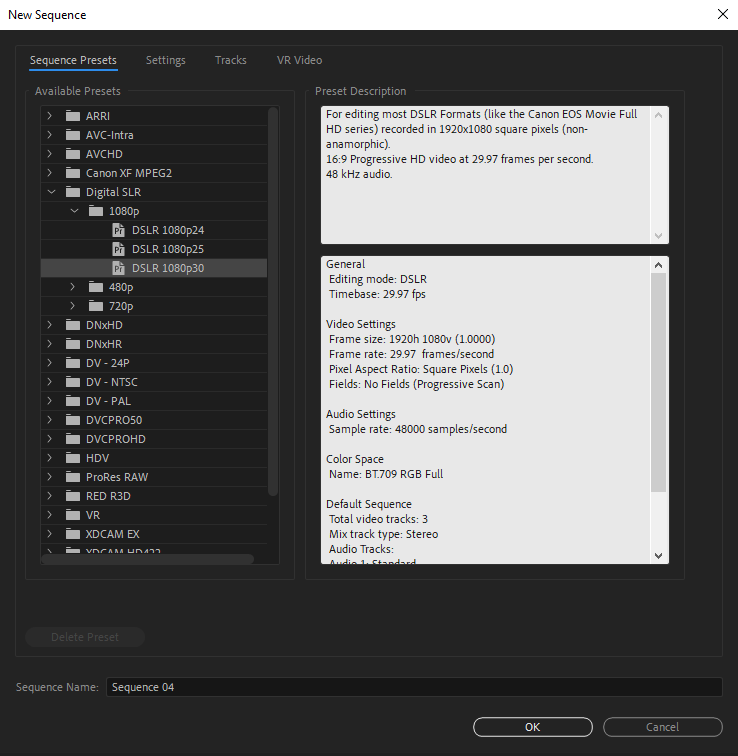
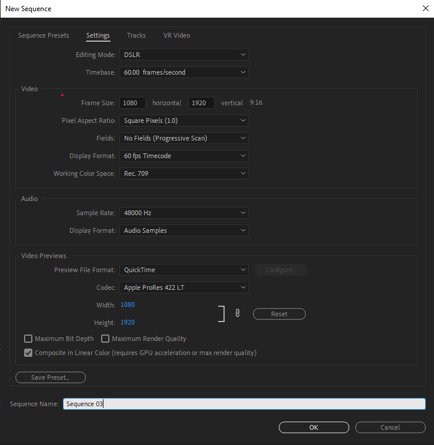
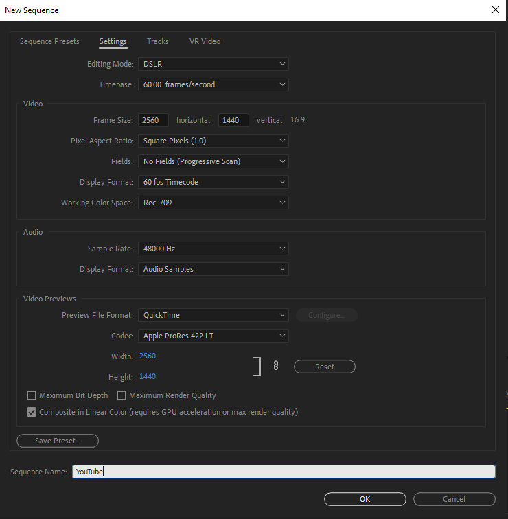

# Sequences

## TikTok

### What Video Size Should You Upload to TikTok

Currently the minimum settings required to upload to TikTok are:

1. MP4 or WebM video format
2. Choose 1080 x 1920 (720×1280 minimum resolution)
3. Maximum of 1 minutes

### Step 1: New Sequence

So now you have your horizontal or vertical footage, the first thing to do is create a new sequence, which you can do by pressing CTRL+N (or Command+N on the Mac).

    

In the new sequence dialogue box select Digital DSLR, then 1080p, and then select DSLR 1080p24.

Select the settings tab, where we need to alter the frame size to a vertical frame size setting.

    

We are essentially swapping the numbers, so 1080 for horizontal and 1920 for vertical, going from a 16:9 to 9:16 aspect ratio.

You can now save this preset for future use, which I highly recommend.

Title it something like ‘TikTok 9:16 1080×1920 23.976p’ so you can differentiate if you make a preset with 60p etc.

Click ok and then enter the sequence name and click ok again.

### Live Instructions

<video controls>
    <source src="./assets/tiktok-sequence.mp4" type="video/mp4">
    Your browser does not support the video tag.
</video> 

## YouTube
### https://www.youtube.com/watch?v=TCGzz-MosyQ

    

