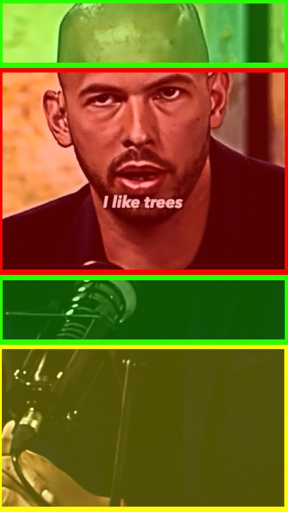

# Fundamentals

We'll take a look at the fundamentals.

You can NEVER forget them.

They ALWAYS apply and every good video follows them.

## Clip Selection

A good clip is ALWAYS a clip that's interesting.

Interesting means that there's SOME kind of value in your clip.

In the current War times, an interesting clip is most likely new information (insider comes out, theory of the reasons for the arrest).

But it can also just be a very inspiring video that reminds everyone of the fact that Tate really only cared about changing peoples life for the better.

But focus is VALUE.

New information is VALUABLE.

That's why Tate giving advice, or inspirational speeches inside of your niche is what you need to focus on.

Entertainment – something funny – can also be value, but it's not what gets your credibility meter up.

At the end, people will buy from you because you changed their lives for the better, not because you made them laugh.

That's why it's important to have more life-changing value than pure entertainment on your accounts.

## Music

Music is ENERGY.

If you pick the correct music – something that fits perfectly to the topic of the video – then it amplifies the message of the video and what people feel when watching it.

A conspiracy video needs spooky, X factor music. Not an emotional piano.

It's ALWAYS 2 things that are important with music:
1) Music needs to match the vibe
2) Music can't distract (not too loud, but not too quiet).

And if you're a pro, you'll try to adjust the music on your timeline in a way where a bass drop inside of the music happens when Tate makes an important point.

## Hook & Placement Zone

We need hooks because they give people a reason to watch our videos.

If you don't have a hook, then someone will make the decision if watching your video is worth in mostly only by the words that are spoken in the first few seconds.

If those words don't directly address the desires of him, for example:

"So, here's what made me a millionaire by age 27"

Than someone will click off.

You NEED a hook in 99% of cases.

And even in the 1% of exceptions, it will make sense to use a hook because you can give people TWO reasons to watch you video.

1) The words that are spoken

"So, here's what made me a millionaire by age 27"

2) The hook they read

"Do THIS To Become Rich In 2023"

Do you understand? Double the benefits.

And he placement zones are important because THAT is where people look.

I put it as a reminder at the bottom.

My eyes naturally look there.

If your hook/subtitles are outside of that zone, it costs energy to find it.

And then I'll end up looking up, down, up, down – because I also want to see Tate talking.

Which is why it's SO important that the subtitles are close to Tate's face.

And why the hook & the subtitles need to be on the same height, because otherwise it COSTS energy to relocate the subtitles.

Humans are lazy.

Remember that.

## Superformat

We do not want people to think they saw your video before.

THAT is why the superformat is key.

Humans hate repetition.

If they can categorise something, it's automatically boring.

"Ah, Tate in the EM room. Saw it before."
"Ah, Tate in the PBD interview. Saw it before."

EVEN if they didn't saw this clip, they THINK they saw it.

The superformat targets this problem.

So they only see a hook, the lifestyle clip, and can hear Tate's words.

At best, your lifestyle clip connects to the topic of the video so it feels congruent.

If the video is about Tate talking about his Bugatti, but the lifestyle clip shows him boxing – then my brain is confused.

And confusion means I need to spend brain calories to CLEAR the confusion, and as humans are lazy, they'll rather scroll further than try to CLEAR the confusion

## Description

Your description is an EXTRA hook.

Use it wisely to create more curiosity.

"Wait for the quote at the END"
"I didn't expected Tate to say THIS 😱"
"This speech completely changes my life"

Say something that highlights that what people will see is completely crazy/insane/funny/valuable.

## Hashtags

Tomorrow we will look at descriptions in detail, for now, what you'll do is, you'll put your hook into the description.

If your hook is: "Cobra On Raising Kids"

Then your description is: "Cobra on Raising Kids"

Now, for hashtags:

They are totally optional.

I grew big accounts while using them, and without using them.

Looking back at my experience, I recommend you to use them at the beginning of your account – first 4 days.

After that, it's totally optional. And I'll adjust my strategy in real-time in my diary based on real-time results.

You can then either follow me, or your Squad Leaders. So hashtags aren't a definite thing.

But when you use them – at the beginning for example –, I'd ONLY use 3 hashtags:
1) #cobra
2) Hashtag related to the topic
3) #cobra + topic

Example, Tate gives relationship advice.
1) #cobra
2) #relationship
3) #cobrarelationship

You will realise that there will only be very few #cobra + topic hashtags.

That's good, because we will CREATE this trend now.

The 'Cobra' trend has just started and you guys will be at the forefront of conquering the keyword and hashtag.

## Comment Fishing

Ask a question.

Make a statement that's easy for people to agree with, or that's controversial.

You WANT people to engage with your comment.

Giving your own opinion + then asking for theirs is an EASY way to fish.

The goal is ALWAYS to not make it look like you're comment fishing.

Be genuinely interested in their opinion.

THAT is the key for asking questions.

That's why giving your own opinion first works so well, because it makes it much more genuine.

Asking "Do you agree" is very weak, because if you REALLY cared about their opinion, you wanted to hear their opinion, and not a "yes or no" answer.

Do you understand?

"Do you agree?" is not bad, but there are BETTER ways, that show that you're REALLY interested in their opinion.

So, ask genuine questions.

AND make sure you reply to good comments

## Humans
Remember, Humans are 100% of your target audience.

Humans are selfish.

They don't care about other people.

Ask yourself, does my video make the person think this might help their life?

A lot of you guys when crafting your hooks, you guys don't line the incentives up correctly.

"Connections are more important than you think"

VS.

"How to use connections to get rich."

Do you see the difference?

Which video would you rather watch?

Why?

Personally, I'd rather watch the second video because it will teach me how to get rich using connections.

The first one, will explain something that I probably already know.

They claim connections are more important than I think, but maybe I think connections are everything.

Maybe I think the video will be like all the others.

"YoUR NeTwoRk IS YOuR NeT wORth"

Like we so often hear.

Don't misunderstand, Your Network is your Net Worth is 100% accurate.

But MOST people, are poor and arrogant.

They've already been given the advice to increase their connections 100s of times and they just didn't listen.

They don't want to hear the same lecture again.

But "HOW" to use your connections "TO GET RICH"

That is interesting, do you see why?

It's because humans are selfish.

This video might teach them something they don't know that will lead them directly to wealth.

Always keep this fundamental lesson in mind for all marketing and human interactions.

## Catching Attention
The fundamentals of a good video.

TikTok, Instagram, YouTube Shorts; it's all about videos and it's fast paced.

Your audience has the attention span of a Goldfish.

You NEED good hooks, they will decide whether or not to watch your video within the first second.

If you cannot grab their attention within the first second, it doesn't matter how good your video is.

This is why hooks are critical.

Hooks are written statements or questions that make the audience want to watch.

Example:

"Donkey's Brain after only eating McDonalds"

"Billionaire leaks New World Order Plan"

"World Champion explains why eating fish is the only way to reach peak performance"

All these things are hooks,

They're weird, interesting and they make you want to watch.

You need to understand you literally only have 1 second to make the person think "I'll give this video a chance"

The next step?

HOLDING their attention.

Next lesson will go on that in more depth.

## Keeping Attention
You guys are letting things come to conclusions AND still let the video run.

If you want them to keep watching the video, you need to not show them the ending of the movie. If there's a 1-2 second pause, it's clear there's been a conclusion.

Their brain can rest happy and easy.

First point has been completed, NOW second point will commence.

You cannot give them that.

Needs to be BAM BAM BAM.

First point. Second point. Third point. NO PAUSE, NO REST.

By the time they finished the First point, the second point has already begun. THEY DO NOT GET TO CHOOSE IF THEY WANT TO HEAR THE SECOND POINT.

Edit out the pause,

Don't let them CHOOSE.

Keep them on the hook.

ATTACK ATTACK ATTACK.

Let them off when the video is done.