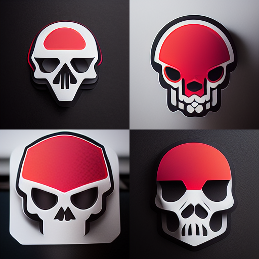

# LOGO

TO create logo's. 

You wil want to use alot less detail (most cases) 

That's why we use --v 3

## Esport Logo

Lets start off with some simple commands. 

```
esport skull logo icon, logo mark --q 2 --v 3
```



<!-- ## Feed it an example

Screenshot logo like this


Upload it to midjourney discord

Click on image in chat

Right-click copy link address

```
/imagine medicinal fungi and mycoremediation website, ui, ux --q 2
```

 -->