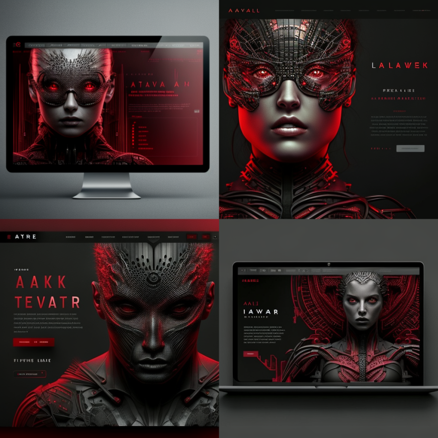
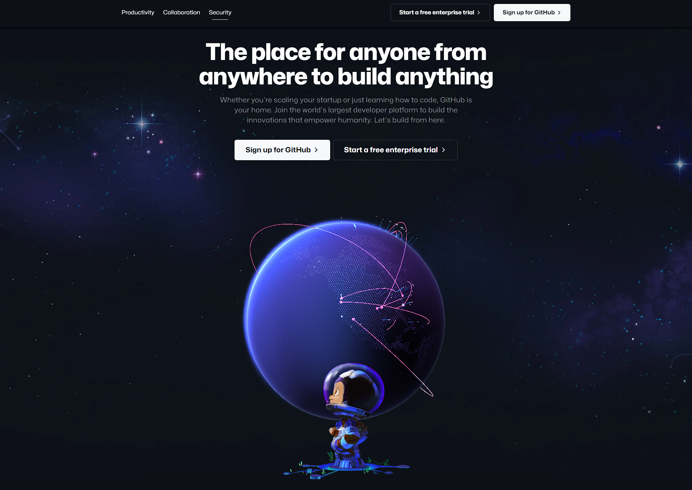
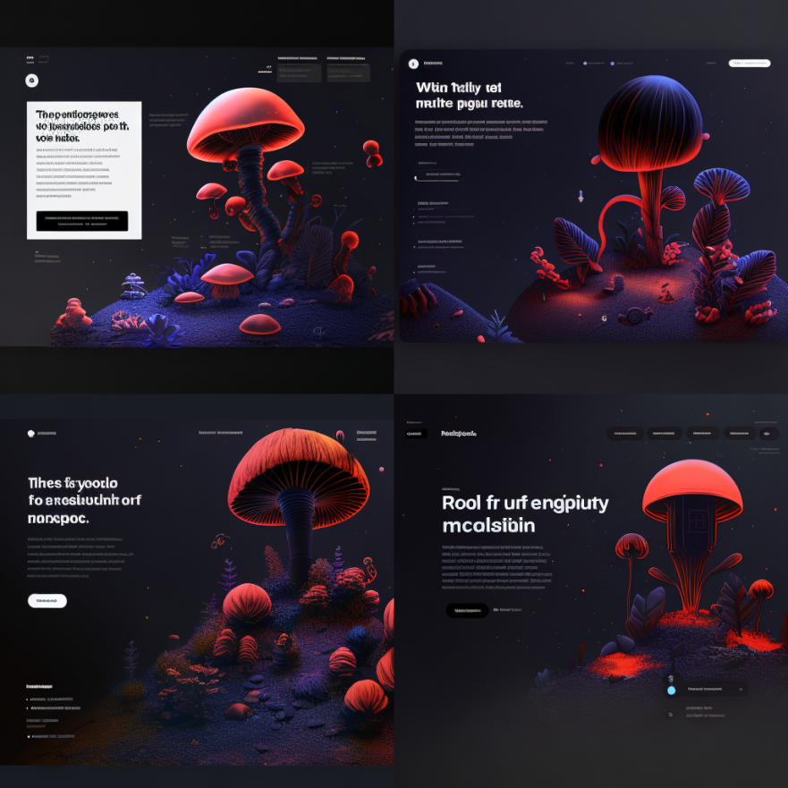

# WEB

Welcome to Midjourney, the AI that helps you create stunning images in just minutes. 

Whether you are a small business owner, a designer, or a marketer, Midjourney has everything you need to elevate your visual content to the next level.

## Generate prototypes

Lets start off with some simple commands. 

```
/imagine stunning website, matrix style graphics, name is "the ai advantage", website, hyper realistic, light purple, dark grey --q 2
```



These mockups are already insane. However watch what it does when you give it an example.

## Feed it an example

Screenshot website like this



Upload it to midjourney discord

Click on image in chat

Right-click copy link address

```
/imagine medicinal fungi and mycoremediation website, ui, ux --q 2
```


