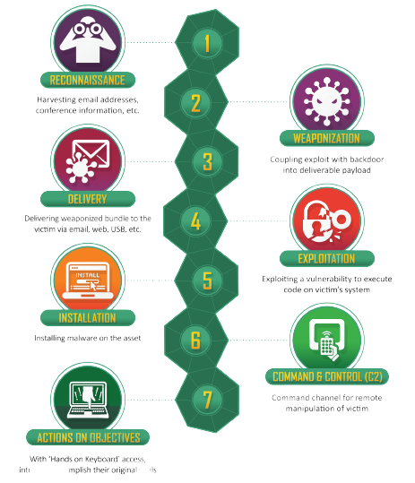

# Cyber Kill Chain®

Developed by Lockheed Martin, the Cyber Kill Chain® framework is part of the Intelligence Driven Defense® model for identification and prevention of cyber intrusions activity.

The model identifies what the adversaries must complete in order to achieve their objective.

The seven steps of the Cyber Kill Chain® enhance visibility into an attack and enrich an analyst’s understanding of an adversary’s tactics, techniques and procedures.

